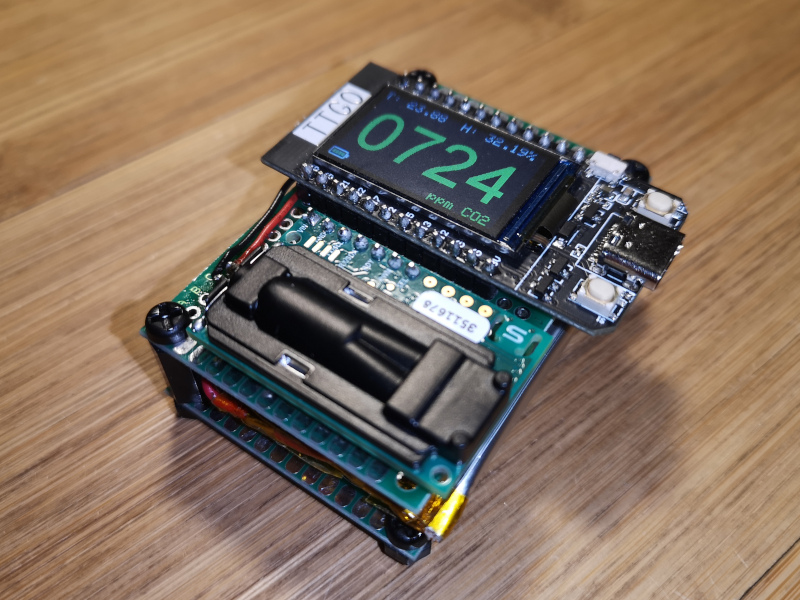
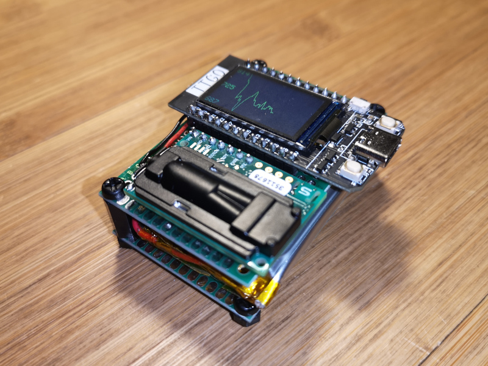

# CO2 measurement

## CO2 measurement with ESP32 and SCD30 sensor

### Features
- Measurement every 5 seconds of the CO2 rate in the air, the temperature and the humidity rate
- Two display modes, navigation with buttons
  - Display of instantaneous values ​​with an RGB color code proportional to the CO2 level
  - Display of a graph with the last 200 measurements
- Calibration (long press on button 2)
- Standby (Deep Sleep) (long press on button 1)
- Battery level monitoring
- Automatic shutdown if battery low

### Parts list
- TTGO T-Display (ESP32 + 1.14" screen)
- Sensirion SCD30 CO2 sensor
- (Optional) 3.7V Lithium Battery

### Wiring
|ESP32 T-Display|SCD30|
|-----|-----|
|3V3|VIN|
|GND|GND|
|GPIO-22/SCL|SCL|
|GPIO21/SDA|SDA|

### Inspired by
- https://github.com/fvanderbiest/arduino-sketches/tree/main/sketch_scd30_ssd1306_neopixel
- http://nousaerons.fr/makersco2/

### Licence
Published under [MIT License](license.txt)